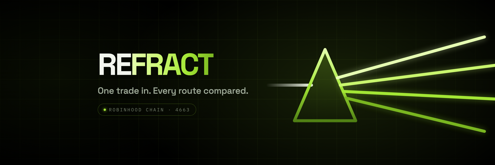
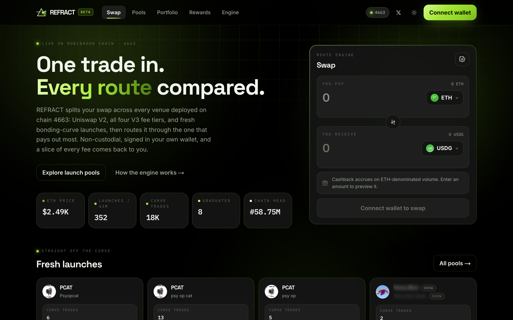
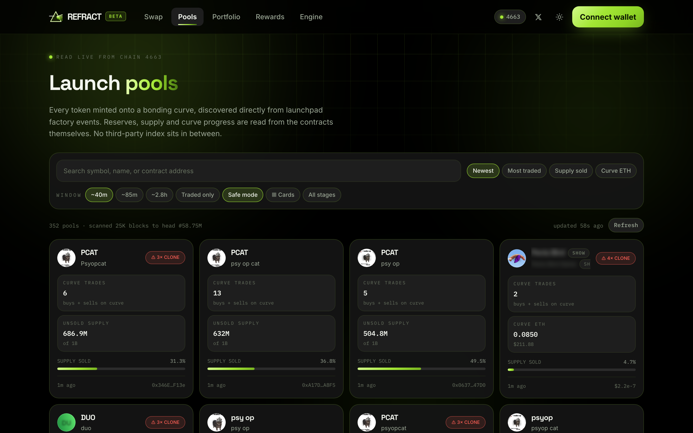

<div align="center">



### One trade in. Every route compared.

A routing exchange and launch-pool explorer for **Robinhood Chain**.
REFRACT quotes every venue on the chain for your pair and settles on whichever pays out most.

[](https://www.refract.exchange)
[](https://x.com/RefractHq_)
[](https://robinhoodchain.blockscout.com)
[](LICENSE)

[**Open the app →**](https://www.refract.exchange) &nbsp;·&nbsp;
[Pools](https://www.refract.exchange/pools) &nbsp;·&nbsp;
[Portfolio](https://www.refract.exchange/portfolio) &nbsp;·&nbsp;
[Rewards](https://www.refract.exchange/rewards) &nbsp;·&nbsp;
[How it works](https://www.refract.exchange/engine) &nbsp;·&nbsp;
[**@RefractHq_**](https://x.com/RefractHq_)

`REFRACT` &nbsp;·&nbsp; `0xBfA6B87E293A4668b86Ee33E80Ff168266781400`

</div>

---



## Why it exists

Most interfaces quote a single pool and call it a price. On a chain with a Uniswap V2 pair and four
V3 fee tiers live at once, that leaves money on the table on almost every trade.

REFRACT quotes all of them and routes through the winner:

```
1 ETH → USDG                    quoted the same second

Uniswap V3   0.01% tier         2,486.66 USDG      ← routed here
Uniswap V3   0.05% tier         2,484.43           −0.09%
Uniswap V3   0.30% tier         2,479.76           −0.28%
Uniswap V2   direct pair        2,471.48           −0.61%
Uniswap V3   1.00% tier         2,340.95           −5.86%
```

Same trade, **+0.61%**, found automatically. Every figure above came from a live quote through the
app — you can reproduce it by loading the site.

## What's inside

**Route engine.** Quotes Uniswap V2 (direct and via the WETH hop) plus all four V3 fee tiers using
the on-chain QuoterV2, ranks them by output, and shows the shortfall of every alternative. Price
impact is measured against a probe trade 1000× smaller on the same venue, with a warning above 5%.
You can always override the pick.

**Launch pools.** New tokens are discovered from launchpad factory events, and each token's bonding
curve is resolved from its launch mint — the single `Transfer` from the zero address carrying full
supply. That signal is protocol-agnostic, so discovery doesn't depend on any one launchpad's private
ABI. Duplicate name/symbol pairs are flagged as possible clones.

**Charts.** Token pages plot executed price reconstructed from that token's own `Swap` events, so
every point is a real fill and gaps in time are genuine gaps in trading. Curve-stage tokens with no
pool show transfer activity instead of an invented price.

**Portfolio.** Holdings are discovered from a wallet's own `Transfer` history rather than a token
list, so a token bought minutes ago on a fresh curve still appears. Each position is priced from its
deepest WETH pool.

**Rewards.** Scans a wallet's Uniswap `Swap` events where it is the recipient, resolves each pool's
WETH side so notionals are denominated correctly, and computes accrued cashback at 0.12% of routed
volume — auditable by anyone against the chain.



## No mocked data

Every number in the interface is read from chain state at request time. There is no third-party
price index, no seeded fixtures, and no mocked responses anywhere in the codebase.

That constraint is enforced in the failure path too. Public RPC endpoints rate-limit aggressively,
and a throttled scan looks identical to "nothing happened" — so incomplete results are marked as
such and the UI shows `—` or a retry notice rather than a confident `0`. An incomplete answer is
never cached as though it were complete.

## Known limitations

Documented here and in the interface itself.

| Limitation | Detail |
| --- | --- |
| Cashback is not claimable | The distributor contract is not deployed. Balances are computed and auditable today; the Rewards page says so rather than showing a claimable number that does not exist. |
| Curve ETH often reads zero | The launchpad observed on this chain does not custody sale proceeds in the curve contract, so there is no on-chain balance to report. The UI leads with what is provable: supply sold, unsold reserve, trade counts. |
| Pre-graduation tokens have no price | A token still on its bonding curve has no Uniswap pool, so there is no pool price to read. A price appears once it graduates. |
| Scan window is bounded | Public RPCs reject wide `eth_getLogs` spans, so discovery runs over a recent, selectable window. |
| Portfolio values are marks | Spot price from the deepest pool, not a quote. A thin pool will not fill at that price. |

## Quickstart

```bash
git clone https://github.com/Refractdotexchange/Refract.git
cd Refract
npm install
npm run dev
```

Open [localhost:3000](http://localhost:3000). No configuration required — the app ships with public
RPC endpoints and an injected-wallet connector, so a fresh clone runs immediately.

```bash
npm run build      # production build
npm run start      # serve the production build
npm run typecheck  # tsc --noEmit
```

**Environment** — optional, both have working defaults:

```bash
NEXT_PUBLIC_RPC_URL=https://rpc.mainnet.chain.robinhood.com
RPC_FALLBACK_URL=https://robinhood-rpc.publicnode.com
```

A dedicated RPC endpoint is recommended for any deployment expecting real traffic; the client fails
over between the two automatically.

## API

Every route reads chain state directly and returns JSON.

| Route | Returns |
| --- | --- |
| `GET /api/quote?in=&out=&amount=` | Ranked routes for a pair with price impact. Amounts in base units. |
| `GET /api/pools?window=` | Recent bonding-curve launches with reserves and activity. |
| `GET /api/stats` | Protocol-level figures for the current window. |
| `GET /api/token/{address}` | Token metadata, venues and pricing. |
| `GET /api/history/{address}?window=` | Executed-price series and volume. |
| `GET /api/portfolio/{address}?window=` | Wallet holdings with marks. |
| `GET /api/rewards/{address}?window=` | Routed volume and accrued cashback. |

## Architecture

```
src/
├── app/
│   ├── page.tsx              Swap, live protocol stats, fresh launches
│   ├── pools/                Launch-pool explorer
│   ├── token/[address]/      Price chart, venues, FDV
│   ├── portfolio/            Wallet holdings priced from live pools
│   ├── rewards/              Cashback accrual tracker
│   └── api/                  Server-side chain reads
├── lib/
│   ├── chain.ts              Chain 4663 definition and verified contract map
│   ├── quote.ts              Route comparison and price impact
│   ├── swap.ts               Route → transaction, incl. router-side wrap/unwrap
│   ├── pools.ts              Launch discovery and curve resolution
│   ├── rewards.ts            Swap-history scan and accrual
│   └── rpc.ts                Throttle, retry with backoff, TTL cache, raw logs
├── hooks/                    Data-fetching hooks
└── components/               UI, including all generated brand graphics

video/                        Remotion project — four explainer films, scored in code
```

**Reliability.** Three measures keep scans complete against rate-limited public RPCs: a
process-wide request gate with spacing and exponential backoff; explicit multicall batch sizing
(viem chunks by a 1024-byte calldata default, which silently turns one logical batch into dozens of
requests); and native balances batched through Multicall3's `getEthBalance` rather than one call per
pool. Independent scan phases are overlapped.

**Stack.** Next.js 15 · React 19 · TypeScript · wagmi · viem · TanStack Query · Tailwind CSS v4.

## Security

REFRACT is non-custodial. It never takes custody of funds — every trade is signed in the user's own
wallet, approvals are scoped to the exact amount of each swap, and the routers are the canonical
Uniswap deployments on chain 4663.

Found something? Open an issue, or reach us on X at [@RefractHq_](https://x.com/RefractHq_).

## Disclaimer

Nothing in this project constitutes financial advice. Tokens launched on a permissionless bonding
curve can be minted, taxed or rugged by their deployer and carry total-loss risk. Always read a
contract before trading it.

Not affiliated with Robinhood Markets, Inc., Uniswap Labs, or any token issuer listed by the
interface.

## License

[MIT](LICENSE) © Refractdotexchange
